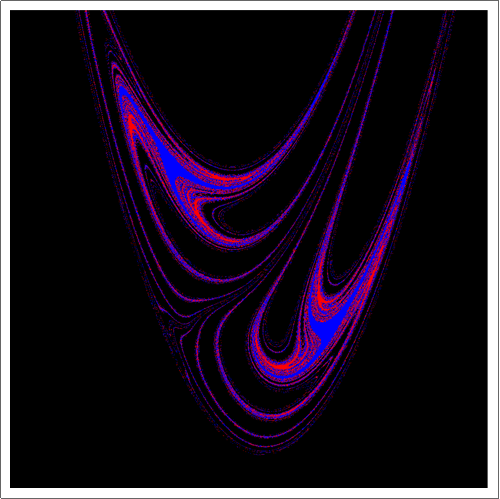

# BasinPlots
In studying dynamical systems (especially nonlinear ones), a useful tool is a plot of the basin of attraction (for dissipative systems) or the exit basins (for conservative systems). A basin of attraction corresponding to a particular attractor is the closure of the set of all initial conditions that leads to that particular attractor (analogously for exit basins). Basin plots provide a way to visualize the fractal features of the dynamical system. The notebooks provided here calculate the basin plots of these two systems:

1. [Henon-Heiles](https://mathworld.wolfram.com/Henon-HeilesEquation.html)
2. [Henon map](https://mathworld.wolfram.com/HenonMap.html)

Here are some cool fractals from these notebooks.

 
